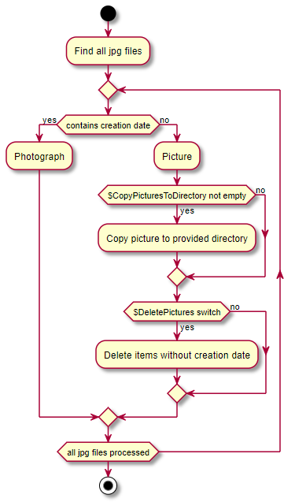
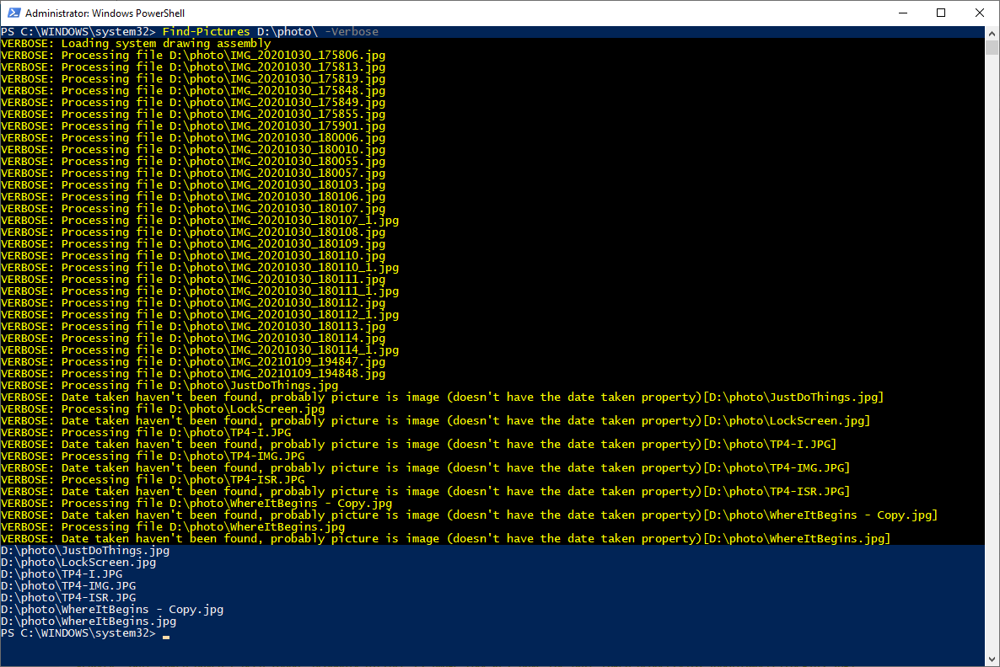
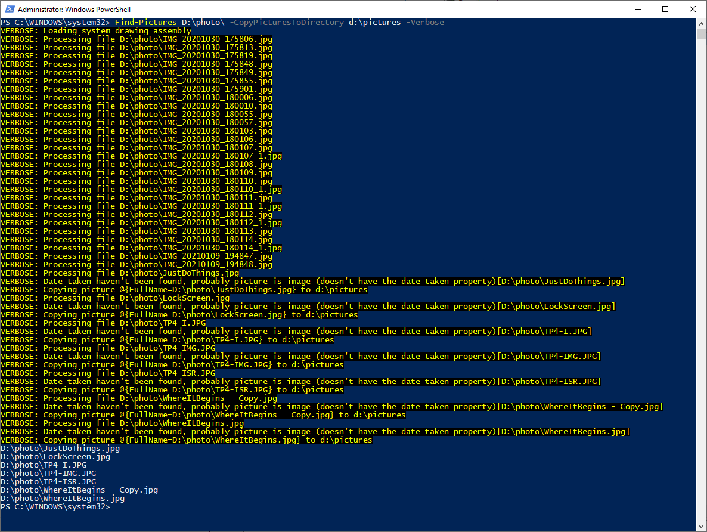
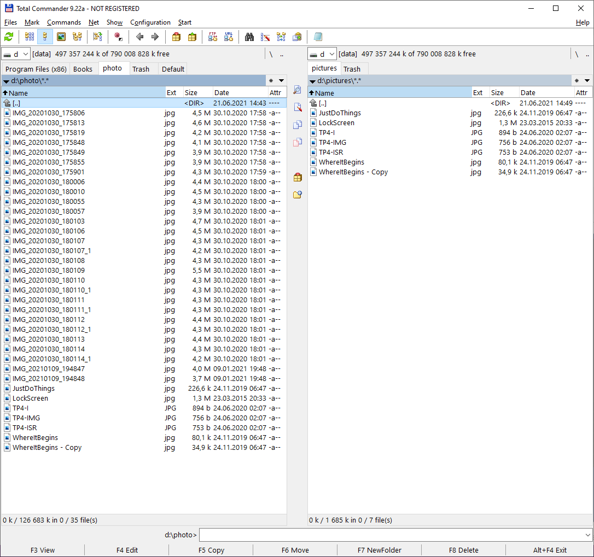
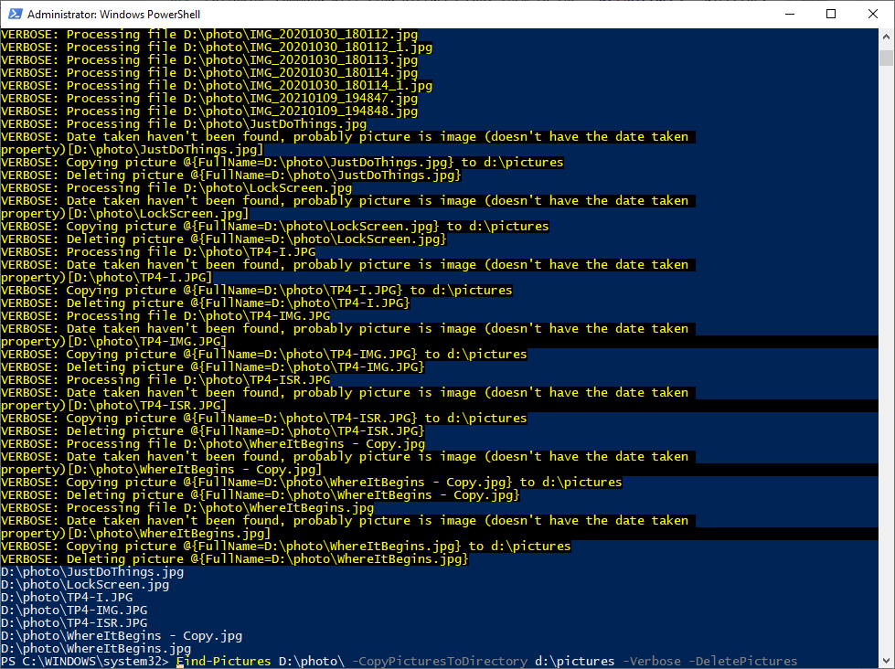
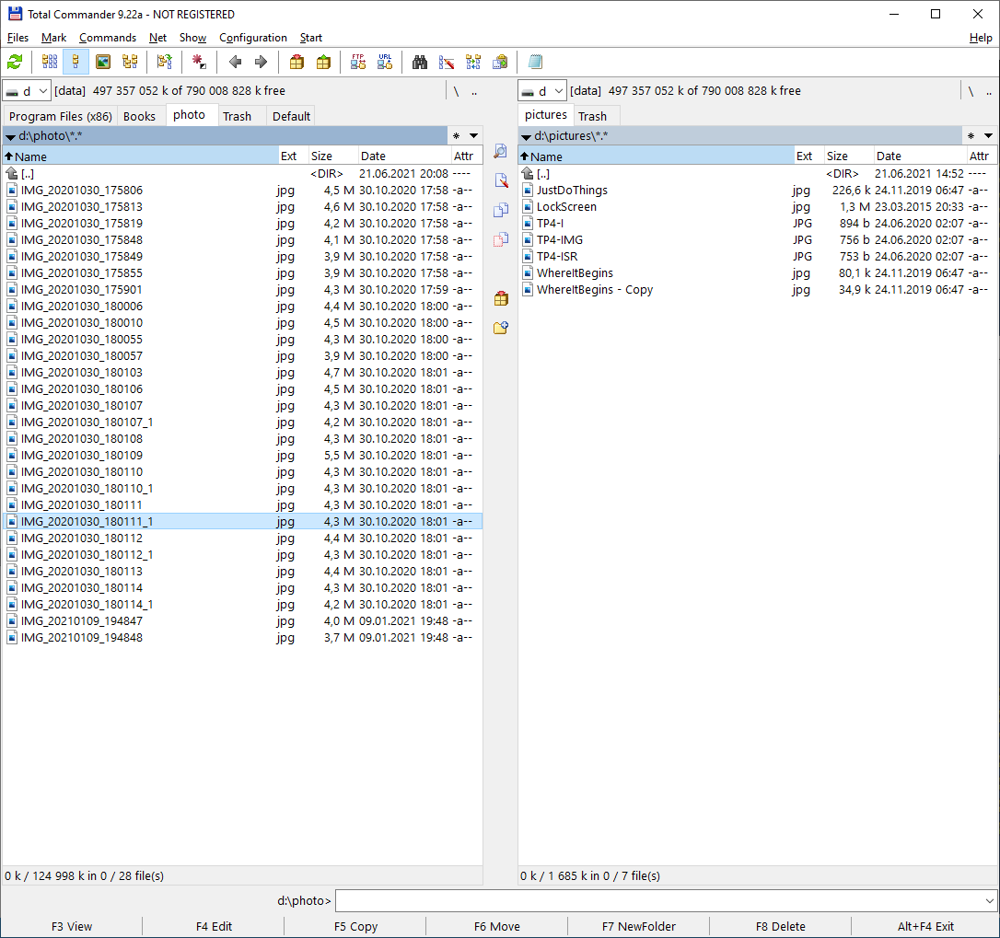

<!--Category:PowerShell--> 
 <p align="right">
    <a href="https://www.powershellgallery.com/packages/ProductivityTools.XXXX/"></a>
    <a href="http://productivitytools.tech/XXX/"><a> 
    <a href="https://github.com/pwujczyk/ProductivityTools.XXX"></a>
</p>
<p align="center">
    <a href="http://http://productivitytools.tech/">
        
    </a>
</p>

 
# Find Pictures

Module looks in the directory for jpg files and checks if some of them are pictures.

<!--more-->

Module does it by validating if taken date exist for given file. It is used by me when I am operating on the photographs and between hundreds of photos some pictures were placed by mistake.

Parameters
- CopyPicturesToDirectory - if any picture will be found it can be copied to chosen directory
- DeletePictures - if you don't have the pictures you could delete them from the directory. It is working very nice with CopyPicturesToDirectory

### Installing

```powershell
Install-Module ProductivityTools.FindPictures
```

<!--og-image-->


### Usage

Following command will find pictures in the **D:\\photo** directory

```powershell
Find-Pictures D:\photo\ -Verbose
```




Following command will find pictures and copy them to the **d:\\pictures** directory
```powershell
Find-Pictures D:\photo\ -CopyPicturesToDirectory d:\pictures -Verbose
```



Results shows files in the new directory.




Following command will find pictures copy them to the **d:\\pictures** directory and it will remove pictures from the source of the directory

```powershell
Find-Pictures D:\photo\ -CopyPicturesToDirectory d:\pictures -Verbose -DeletePictures
```



After the command in the files we will have:

